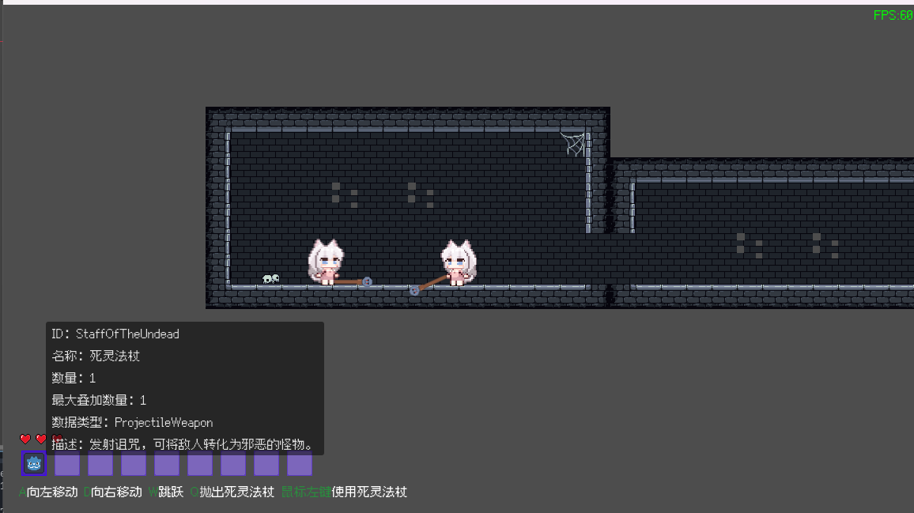

[](https://star-history.com/#Cold-Mint/Traveller&Date)

English [简体中文](README_ZH.md) [にほんご](README_JA.md)

## Intro

Mint's new game.

A pixel cross-platform roguelite game.

## Recent Development progress

| Task                                                   | status        |
| ----------------------------------------------------------- | ------------------ |
| Randomly generated map                         | complete |
| loot                                                 | complete |
| Support still out of the knapsack system | complete       |
| Add AI agents to creatures | In progress |

## Screenshot

Game scene



Level graph editor


## Run the project locally

#### Download engine
1. Download [Godot Engine .Net](https://godotengine.org/).

   After downloading the engine, you will need to download an additional export template to export as an executable program.

2. Download [.NetSDK](https://dotnet.microsoft.com/download).

#### Clone project

Enter the following command in your working directory:

```
git clone https://github.com/Cold-Mint/Traveller.git
```

#### Export

You need to fill in the Export Presets > Resources > Filter to export non-resource files or folders edit box:

```
data/*
```

#### Custom feature

- **disableVersionIsolation** Disable version isolation.

## Configuring Openobserve

> This is optional, and the game will work even if you do not configure Openobserve.

openobserve is used to continuously collect logs and alarm information after a game has been released.

#### Set up the openobserve server

see：[openobserve](https://github.com/openobserve/openobserve)

#### Write configuration

After you have set up an openobserve server, follow the following steps to configure the file:

1. Create a configuration file named **AppConfig.yaml** in the root directory of your project.

2. Fill in the information for the remote server.

   ```yaml
   open_observe:
     address: [address]
     access_token: [token]
     org_id: [org_id]
     stream_name: [stream_name]
   ```
   
   address Indicates the address of the server in the format of http(s)://www.example.com. (Support http and https)

## Participate in translation

The project is prepared for localization at the beginning of writing. You can edit the csv file in the locals directory. To modify and add new translations.

## License

[GPL-3.0 license](LICENSE)

Support commercial, anyone can modify, build, and sell or distribute for free. For all derivative versions of this project, under the GPL, you shall  **retain the author copyright** and **publish the modified source code**.

> Note: You have the right to sell the modified version, but not the original.
>

## Contributor

<a href="https://github.com/Cold-Mint/Traveller/graphs/contributors">
  
</a>
