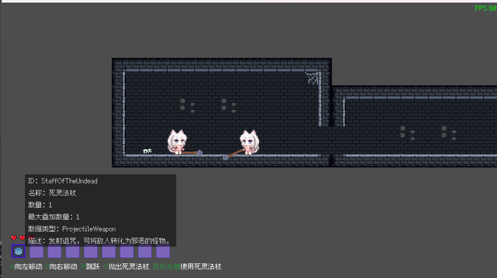
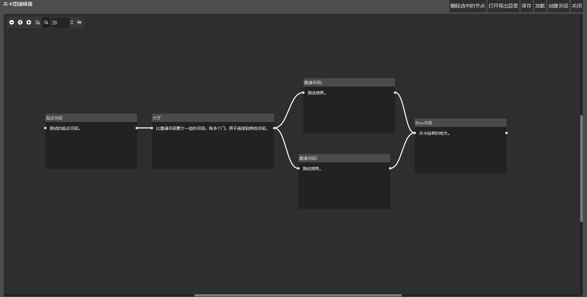

[English](README.md) 简体中文 [にほんご](README_JP.md)


[](https://star-history.com/#Cold-Mint/Traveller&Date)

## 简介

薄荷的新作游戏。

一款像素的跨平台的Roguelite游戏。

## 近期研发进度

| 任务                                                   | 状态        |
| ----------------------------------------------------------- | ------------------ |
| 随机生成地图                         | 完成   |
| 战利品                                                 | 进行中      |
| 支持仍出的背包系统 | 等待                |
| 为生物添加AI代理 | 等待 |

## 屏幕截图

游戏场景



关卡编辑器



## 在本地运行项目

#### 下载引擎
1. 下载[Godot Engine .Net](https://godotengine.org/)。

   下载引擎后，您需要额外下载导出模板才能导出为可执行程序。

2. 下载 [.NetSDK](https://dotnet.microsoft.com/download).

#### 克隆项目

在您的工作目录输入以下指令：

```
git clone https://github.com/Cold-Mint/Traveller.git
```

## 参与翻译

此项目在编写之初就为本地化做好了准备。您可以编辑locals目录下的csv文件。来修改和添加新的翻译。

## 许可证

[GPL-3.0 license](LICENSE)

查看协议的中文翻译版本：[GPL-3.0 license 简体中文](LICENSE_ZH)

支持商用，任何人可修改，构建，并用于售卖或免费发布。对于此项目的所有衍生版本，根据GPL协议，您应当**保留作者版权**，以及**公开修改后的源代码**。

> 注意：您有权售卖修改后的版本，但不能售卖原版。

## 贡献者

<a href="https://github.com/Cold-Mint/Traveller/graphs/contributors">
  
</a>